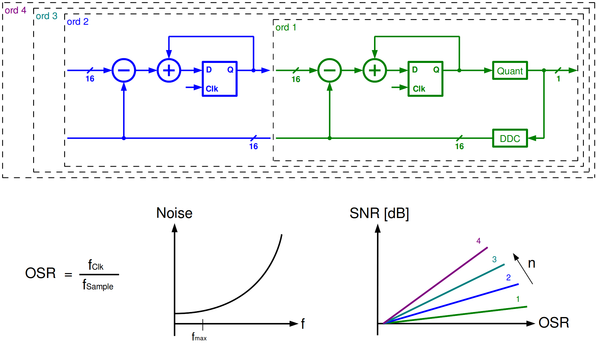

# libusagi
libusagi - **U**niversal **S**igma-delta **A**nalo**g** **I**nterface is a header-only library for converting discrete multilevel signal to binary bitstream via Σ-Δ modulation. 

## Highlights
* Full implementation of a Σ-Δ modulator from oversampling, interpolation to modulation with simple interface
* Configurable oversampling rate (OSR), modulation order, interpolation filter and data type.
* No external dependency for core implementation (some interpolation filter requires [liquid DSP](https://github.com/jgaeddert/liquid-dsp/))

## Structure
### Oversampler
Source directory: src/filter

Oversamplers take a n-bit sample and produce `M` n-bit value at one time, where `M` is the oversampling rate (OSR). Oversamplers provide smooth upconverted signal to the modulator. Predefined oversamplers are:

* #### [Sample & Hold](src/filter/hold.h)
Directory: src/filter/hold.h

### Modulator
Directory: src/core

Modulators take a n-bit sample and produce a 1bit value at one time. Modulators employ low pass filters (LPFs) to perform noise-shaping, shifting the quantizing noise to higher frequency. Predefined modulators are:

* #### [CIFB](src/core/CIFB.h)
Source: src/core/CIFB.h

Modulator with CIFB (Cascade of Integrators with Distributed Feedback) filter

* #### [NIF](src/core/NIF.h)
Source: src/core/NIF.h

Modulator with configurable filter, no input feedforward. 

### Convertor
Source directory: src/sdda.h

## Tests
### Test with CERN Root

## License
This project is under the [BSD-3-Clause License](LICENSE).